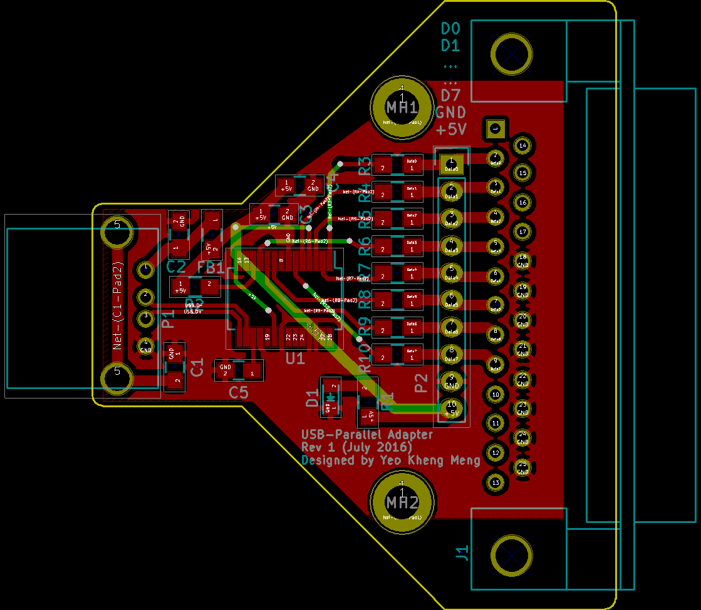
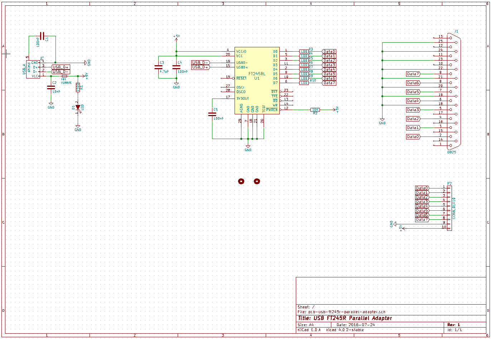

# pcb-usb-ft245r-parallel-adapter
A USB to parallel adapter using the FTDI FT245R chip. This is not a IEEE 1284 compliant parallel port. Just using the DB25 connector to access the data pins.

##PCB Design software and addons used

1. Kicad 4.0.2 or later

##Images
Not available yet

##Schematic drawings

##Parts required
Not available yet

##References
1. [FTDI library](https://code.launchpad.net/~mrnuke/kicad/ftdi_symlib)
